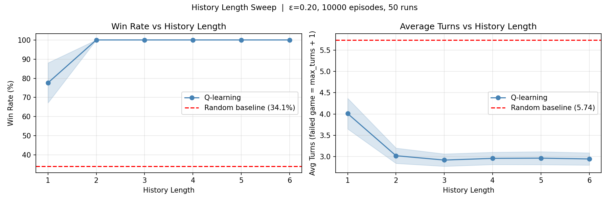
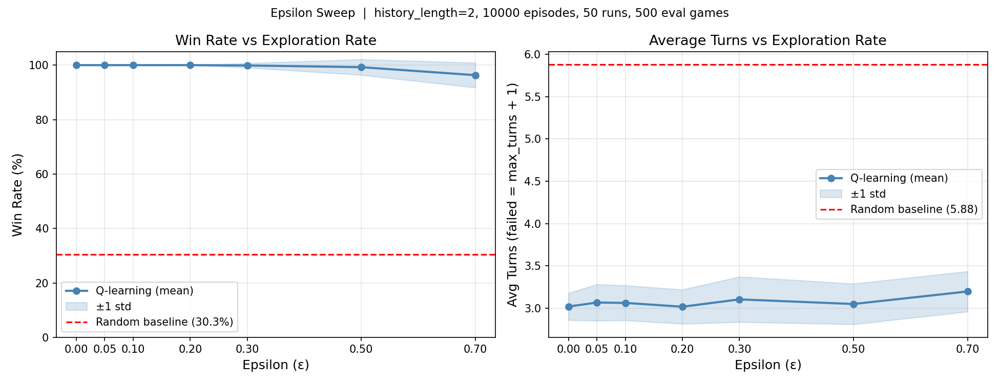
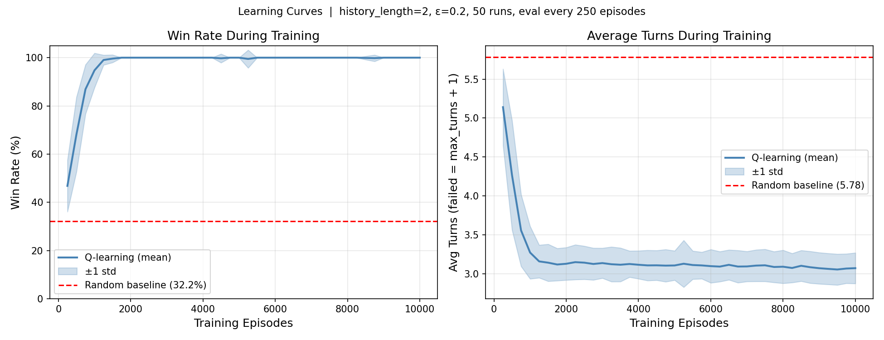
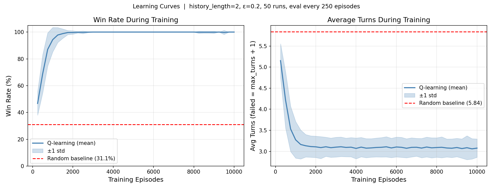
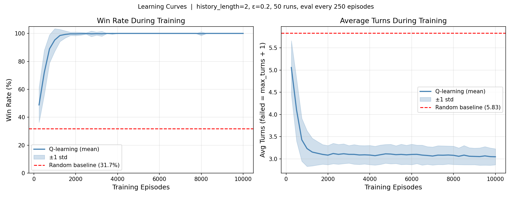

# Tabular Q-Learning for Mastermind: State Representation and Exploration Rate

---

## Abstract

This report presents an implementation and empirical investigation of tabular Q-learning applied to a simplified two-position, four-colour variant of the Mastermind code-breaking game. Three experiments are conducted: (1) a sweep over state history lengths to identify the optimal state representation, (2) a sweep over the exploration rate ε to characterise the exploration–exploitation trade-off, and (3) a learning-curve analysis to characterise convergence dynamics. All results are reported as mean ± standard deviation across 50 independent training runs. The agent reliably achieves a 100% win rate with `history_length = 2` and ε ∈ [0.0, 0.2], compared to a random baseline win rate of approximately 31%. Convergence to the optimal policy is achieved within roughly 2,000 training episodes out of a total budget of 10,000.

---

## 1. Introduction

Reinforcement learning (RL) provides a principled framework for training agents to make sequential decisions through interaction with an environment. In the tabular setting, the agent explicitly stores value estimates for every visited state–action pair and updates them via the Bellman equation. While such methods do not scale to large state spaces, they serve as a transparent and theoretically well-understood testbed for studying core RL concepts, including state representation, exploration strategy, and convergence behaviour.

This report applies tabular Q-learning to a two-position, four-colour variant of Mastermind. At each turn the agent guesses a secret code and receives feedback in the form of **black pegs** (correct colour, correct position) and **white pegs** (correct colour, wrong position). The game ends when the agent guesses the code exactly or exhausts a fixed turn budget. With only 4² = 16 possible codes, the problem is small enough for tabular methods while remaining non-trivial: the optimal action at any given turn depends on the accumulated history of guesses and feedback, making the choice of state representation a central design question.

---

## 2. Background

### 2.1 The Mastermind Environment

The environment uses `num_positions = 2`, `num_colors = 4`, and `max_turns = 6`, yielding 16 possible codes indexed 0–15. At each step the agent selects action *a* ∈ {0, …, 15}, which maps to a code tuple. The environment computes feedback (*b*, *w*) — black and white peg counts — and returns reward +10.0 on a win or −1.0 otherwise. The episode terminates on a win or when the turn count reaches `max_turns`.

### 2.2 State Representation

The state is a tuple of the *N* most recent turn records, where *N* = `history_length`. Each record takes the form (guess₁, guess₂, *b*, *w*). Slots for turns not yet played are `None`. Example after two guesses with `history_length = 4`:

```
s = ((0, 0, 0, 0), (1, 1, 1, 0), None, None)
```

The state tuple is used directly as a dictionary key in the Q-table.

### 2.3 Q-Learning

Q-learning is an off-policy temporal-difference algorithm that learns Q(*s*, *a*): the expected cumulative discounted reward for taking action *a* in state *s* and following the greedy policy thereafter. After each transition (*s*, *a*, *r*, *s*′, done), the Q-table is updated as:

$$Q(s,a) \leftarrow Q(s,a) + \eta\,[\delta - Q(s,a)]$$

where the TD target δ is:

$$\delta = \begin{cases} r & \text{if terminal} \\ r + \gamma \max_{a'} Q(s', a') & \text{otherwise} \end{cases}$$

Here η = 0.2 is the learning rate and γ = 0.99 is the discount factor, both fixed throughout. The quantity δ − Q(*s*, *a*) is the **TD error**: a positive value means the outcome exceeded expectations (Q-value updated upward); a negative value means the converse.

The terminal case is essential: applying the non-terminal formula at the end of an episode would bootstrap from a meaningless next-state value, introducing systematic bias. The strongest terminal signal is *r* = +10.0 on a win, producing a TD error of 10.0 − 0.0 = 10.0 in early training when Q-values are uniformly zero.

Action selection follows an ε-greedy policy: with probability ε a uniformly random action is chosen (exploration); with probability 1 − ε the greedy action arg max Q(*s*, *a*) is selected (exploitation). Ties are broken uniformly at random. During evaluation ε is set to zero.

---

## 3. Implementation

Two methods were implemented in `QLearningAgent`:

**`select_action`** implements ε-greedy selection. It draws *u* ~ U[0,1) and returns a random action if *u* < ε and `explore=True`, otherwise returning `Q.get_best_action(state)`. The `explore` flag is `False` during evaluation to test the pure greedy policy.

**`update`** applies the Q-learning update. It retrieves the current estimate via `Q.get`, computes the TD target (using `Q.get_max_value` for non-terminal steps, bare reward for terminal), and stores the result via `Q.set`.

A key property: all Q-values initialise to 0.0, so early greedy selection is effectively random due to universal ties. This **implicit exploration** is sufficient to cover the small state space at `history_length = 2`, even at ε = 0 — discussed further in Section 5.

---

## 4. Experiment 1: History Length

### Setup

History lengths *N* ∈ {1, 2, 3, 4, 5, 6} were evaluated with ε = 0.2 fixed. For each value, 50 independent agents were trained for 10,000 episodes and evaluated over 500 games. The random baseline was estimated over 2,000 games.

### Results

| History Length | Win Rate (%) | Avg Turns |
|:-:|:-:|:-:|
| 1 | 77.6 ± 10.4 | 4.01 ± 0.36 |
| 2 | 100.0 ± 0.0 | 3.02 ± 0.18 |
| 3 | 100.0 ± 0.0 | 2.92 ± 0.15 |
| 4 | 100.0 ± 0.0 | 2.96 ± 0.14 |
| 5 | 100.0 ± 0.0 | 2.96 ± 0.15 |
| 6 | 100.0 ± 0.0 | 2.94 ± 0.14 |
| **Random baseline** | **32.2** | **5.78** |

*Table 1: History length sweep — 50 runs, 10,000 episodes, ε = 0.2.*



*Figure 1: Win rate and average turns vs. history length. Shaded regions indicate ±1 std across 50 runs. Dashed red line is the random baseline.*

### Discussion

**History length 1.** With *N* = 1 the agent achieves 77.6% (±10.4%), substantially above the random baseline of 32.2% but well short of 100%. The high variance indicates instability across seeds. The root cause is a violation of the **Markov property**: a single turn record is insufficient to uniquely characterise game situations. Two games with different histories can produce the same most-recent (guess, *b*, *w*) record yet require different next actions. The agent is forced to map genuinely distinct situations to a single state, and no action can be optimal across all of them.

**Optimal history length.** `history_length = 2` achieves 100% win rate with zero variance across all 50 runs and 3.02 average turns — a 47% reduction relative to the random baseline. Two turns of feedback are almost always sufficient to narrow the set of consistent codes to a single candidate, making the state effectively Markov. Increasing *N* beyond 2 produces no win-rate improvement; marginal reductions in average turns plateau after *N* = 3. Given the smallest state space and strongest per-run consistency, **N = 2 is selected for subsequent experiments**.

**State space trade-off.** Each additional history slot multiplies the number of distinct Q-table entries required. With 2 positions and 4 colours the growth is manageable within the tested range and 10,000-episode budget: no degradation at longer histories was observed. In larger game configurations this trade-off would materialise sooner, as rare state visits would prevent reliable Q-value estimates.

---

## 5. Experiment 2: Exploration Rate

### Setup

With `history_length = 2` fixed, ε was swept over {0.0, 0.05, 0.1, 0.2, 0.3, 0.5, 0.7}. For each value, 50 independent agents were trained for 10,000 episodes and evaluated over 500 games. The experiment was replicated three times. Results are averaged across replicates.

### Results

| ε | Win Rate (%) | Avg Turns |
|:-:|:-:|:-:|
| 0.0 | 100.0 ± 0.0 | 3.06 ± 0.21 |
| 0.05 | 100.0 ± 0.0 | 3.05 ± 0.20 |
| 0.1 | 100.0 ± 0.0 | 3.06 ± 0.21 |
| 0.2 | 100.0 ± 0.0 | 3.01 ± 0.18 |
| 0.3 | ≈99.9 ± 0.7 | 3.05 ± 0.22 |
| 0.5 | ≈99.6 ± 1.8 | 3.00 ± 0.18 |
| 0.7 | ≈95.8 ± 5.0 | 3.20 ± 0.25 |
| **Random baseline** | **≈31** | **≈5.83** |

*Table 2: Epsilon sweep — averaged across 3 replicates of 50 runs, 10,000 episodes, `history_length = 2`.*



*Figure 2: Win rate and average turns vs. ε. Shaded regions show ±1 std across 50 runs.*

### Discussion

**Performance at ε = 0.** The agent achieves 100% win rate at ε = 0, consistent across all three replicates. This is explained by three interacting properties: (1) all Q-values initialise to 0.0, making early greedy selection uniformly random; (2) the Q-table's tie-breaking is uniformly random, ensuring broad early exploration; and (3) the first win produces a TD error of 10.0, rapidly differentiating useful state–action pairs. Together these properties constitute **implicit exploration** sufficient to cover the small state space at *N* = 2 without requiring explicit randomness.

**Optimal ε regime.** Win rate remains at 100% with zero variance for ε ∈ [0.0, 0.2]. Performance degrades at ε = 0.3 (≈99.9%), more clearly at ε = 0.5 (≈99.6%), and substantially at ε = 0.7 (≈95.8%, ±5.0%). Within the flat region, average turns provides secondary discrimination: ε = 0.2 achieves 3.01 turns — the lowest of the plateau and directionally consistent across all replicates. **ε = 0.2 is selected for Experiment 3**.

**Exploration–exploitation trade-off.** If ε is too low, the agent commits prematurely to its current estimates and may miss unvisited regions of the state space — a risk mitigated here by implicit exploration but not in general. If ε is too high, the agent continues acting randomly even after accumulating reliable Q-values: at ε = 0.7 the win rate drops to ≈95.8% with ±5.0% standard deviation, reflecting Q-value disruption from excessive random updates. Evaluation uses ε = 0 (`explore=False`) because it measures the quality of the *learned greedy policy*; retaining randomness would mix learned behaviour with arbitrary actions, undermining the validity of the metric.

---

## 6. Experiment 3: Learning Dynamics

### Setup

With `history_length = 2` and ε = 0.2, learning curves were recorded across 50 independent runs. Each run trained for 10,000 episodes; the greedy policy was evaluated over 200 games every 250 episodes (40 checkpoints per run). Mean and standard deviation were computed across runs at each checkpoint. The experiment was replicated three times.

### Results

| Episodes | Win Rate (%) | Avg Turns |
|:-:|:-:|:-:|
| 250 | 46.8 ± 10.7 | 5.14 ± 0.49 |
| 500 | 68.2 ± 15.5 | 4.27 ± 0.70 |
| 750 | 86.9 ± 10.2 | 3.56 ± 0.46 |
| 1000 | 94.8 ± 7.1 | 3.27 ± 0.34 |
| 1250 | 99.0 ± 2.1 | 3.16 ± 0.21 |
| 1750 | 100.0 ± 0.0 | 3.12 ± 0.21 |
| 5000 | 100.0 ± 0.0 | 3.11 ± 0.19 |
| 10000 | 100.0 ± 0.0 | 3.07 ± 0.20 |
| **Random baseline** | **32.2** | **5.78** |

*Table 3: Selected learning curve checkpoints from Replicate 1 — 50 runs, ε = 0.2, `history_length = 2`.*



*Figure 3: Learning curves for Replicate 1. Shaded bands show ±1 std across 50 runs.*



*Figure 4: Learning curves for Replicate 2.*



*Figure 5: Learning curves for Replicate 3.*

### Discussion

**Convergence speed.** Learning begins immediately: by episode 250 the mean win rate reaches ≈47%, already well above the 32.2% random baseline. The improvement is steep through the first 1,000 episodes (≈95%) and the mean reaches 100% by episode 1,750–3,000 depending on the replicate. This spread reflects natural seed-to-seed variability: in all cases full convergence occurs within the first 30% of the episode budget. The remaining 7,000+ episodes contribute no further change to win rate. Wide standard deviation bands in the first 750 episodes (±10–15%) reflect genuine inter-run variability; their collapse to ±0.0% from episode 2,000–3,000 confirms that all 50 runs converge to the same optimal policy regardless of early exploration trajectory.

**Two-phase learning.** Average turns continues decreasing after win rate plateaus. In Replicate 1, average turns falls from 3.12 at episode 1,750 to 3.07 at episode 10,000 — consistent across all three replicates. This two-phase dynamic arises from the reward structure: the +10.0 win signal dominates early updates and drives rapid correctness convergence, while the −1.0 per-step penalty exerts weaker but persistent pressure toward shorter solutions. The discount factor γ = 0.99 reinforces this by assigning marginally lower value to delayed wins.

**Importance of multiple runs.** Replicate 1 shows the mean reaching 100% by episode 1,750; Replicates 2 and 3 require until ≈episode 3,000. Reporting only a single run would over- or under-state typical convergence speed. The mean ± std across 50 runs captures the full distribution of convergence behaviour. Conclusions stabilised after approximately 20–25 runs; adding further runs beyond 30 produced no visible change in curve shape or band width.

**Average-turns metric.** The metric assigns penalty `max_turns + 1 = 7` to each unsolved game. This is preferable to averaging only over wins for two reasons. First, it collapses win rate and efficiency into a single comparable number: an agent winning 90% of games in 2 turns scores 0.9 × 2 + 0.1 × 7 = 2.5, correctly ranked above an agent winning 100% in 4 turns (score 4.0). Second, excluding failures would make poor policies appear artificially efficient — an agent that almost always loses but occasionally wins immediately would report 1.0 average turns without the penalty, which is misleading.

---

## 7. Conclusion

Tabular Q-learning effectively solves the 2-position, 4-colour Mastermind problem, achieving a 100% win rate and ≈3.0 average turns against a random baseline of 31% win rate and 5.8 average turns. Three key findings emerge:

1. **State representation is critical.** `history_length = 1` is insufficient for the state to be Markov (win rate ≈77.6%), while `history_length = 2` provides complete information for near-optimal decisions and yields perfect convergence across all 50 runs.

2. **The optimal exploration regime is broad.** Any ε ∈ [0.0, 0.2] produces 100% win rate, including ε = 0, due to implicit exploration from uniform Q-value initialisation and random tie-breaking. Explicit randomness contributes only marginally in this small, well-structured problem.

3. **Convergence is rapid.** The optimal policy is reliably learned within 2,000–3,000 of the 10,000 training episodes. Subsequent training produces only marginal efficiency improvement through the discount-driven pressure toward shorter solutions.

These results illustrate how state representation, exploration strategy, and reward shaping interact to determine the quality and speed of reinforcement learning in a finite tabular environment.

---

## References

[1] R. S. Sutton and A. G. Barto, *Reinforcement Learning: An Introduction*, 2nd ed. Cambridge, MA: MIT Press, 2018.

[2] C. J. C. H. Watkins and P. Dayan, "Q-learning," *Machine Learning*, vol. 8, no. 3–4, pp. 279–292, 1992.